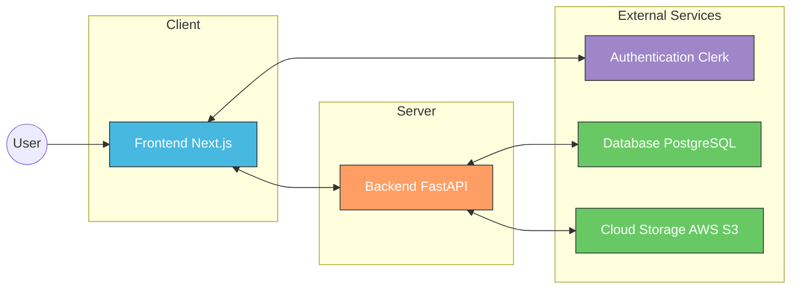
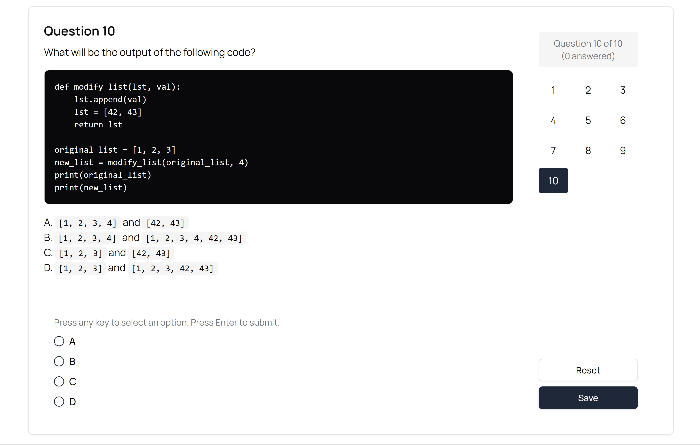
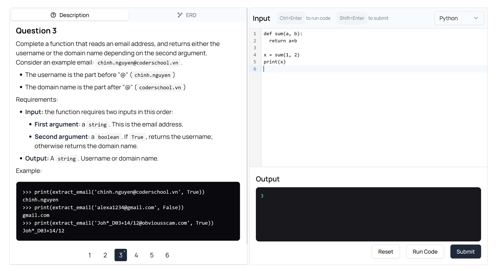
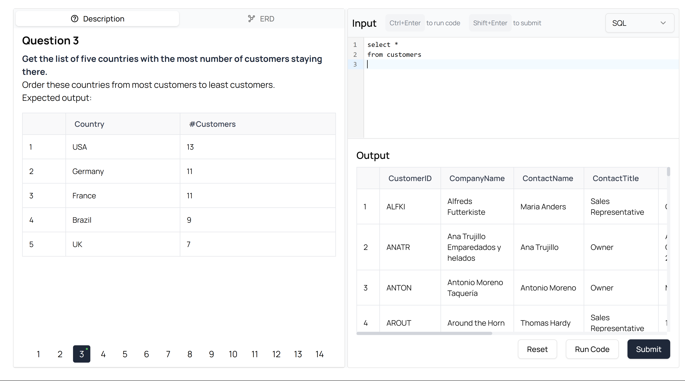
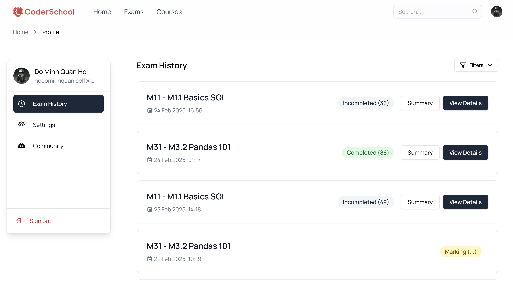
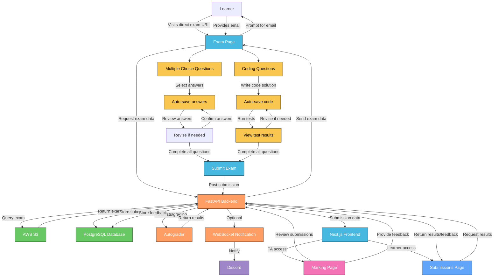

# CS eAssessment Platform

This document provides a detailed overview of the eAssessment Platform, an online platform designed to deliver online exams for Coderschool's courses.

Disclaimer: Current rollout does not include authentication and authorization features from Clerk, users are required to input their emails to attempt the exam.

## Table of Contents

- [CS eAssessment Platform](#cs-eassessment-platform)
  - [Table of Contents](#table-of-contents)
  - [Project Overview](#project-overview)
  - [System Architecture](#system-architecture)
  - [Tech Stack](#tech-stack)
    - [Frontend](#frontend)
    - [Backend](#backend)
  - [Application Flow](#application-flow)
  - [Folder Structure](#folder-structure)
    - [Frontend (Next.js)](#frontend-nextjs)
    - [Backend (FastAPI)](#backend-fastapi)
  - [Exam Content Management](#exam-content-management)
    - [Content Storage](#content-storage)
    - [Automated S3 Synchronization](#automated-s3-synchronization)
  - [Authentication (in development)](#authentication-in-development)
  - [Detailed Component Documentation](#detailed-component-documentation)

## Project Overview

The eAssessment Platform is a comprehensive online examination platform designed for Coderschool courses. It facilitates:

- Multiple-choice assessment for theoretical knowledge
- Coding problems with live code execution capabilities
- Real-time progress tracking and result compilation

The system follows a modular approach with distinct sections for different types of exams (SQL, Python, Pandas) and assessment types (multiple choice and coding problems).

## System Architecture



Key architectural components include:

1. **Frontend Layer**: 
   - Next.js for server-side rendering and route handling
   - State management with React Hooks
   - Shadcn UI components with Tailwind CSS

2. **Backend Layer**:
   - FastAPI for backend processing and API endpoints
   - Exam code execution and evaluation using pure Python
   - Submission processing and storage
   - Websocket connections for Discord realtime notifications

3. **Authentication Layer**: 
   - Clerk for secure user authentication and session management
   - Role-based access control

4. **Data Storage**: 
   - PostgreSQL database for storing user submissions and exam results
   - AWS S3 for storing exam content, exam solutions, and test cases

<!-- ## Key Features

### 1. Authentication and Authorization
- User registration and login via Clerk
- Role-based access for students and administrators
- Public and authenticated exam modes

### 2. Exam Types
- Multiple-choice assessments with automatic grading
- Coding problems with real-time execution and validation
- Support for SQL, Python and Pandas problem types

### 3. User Experience
- Responsive design for desktop and mobile access
- Rich code editing experience with syntax highlighting
- Progress tracking and auto-saving of responses

### 4. Administration
- Comprehensive submission tracking
- Detailed performance analytics
- Custom scoring and feedback mechanisms

<div style="display: flex;">
  
  
</div>

<div style="display: flex; margin-top: 10px;">
  
  
</div> -->

## Tech Stack

### Frontend
- **Framework**: Next.js 15
- **Language**: TypeScript
- **Styling**: Tailwind CSS
- **UI Components**: Shadcn UI

### Backend
- **Framework**: FastAPI
- **Language**: Python
- **Database**: PostgreSQL (Neon) via SQLAlchemy ORM
- **Storage**: AWS S3
- **Code Execution & Evaluation**: Python
- **Real-time Notification (for Discord)**: WebSockets

## Application Flow



The diagram above illustrates the flow of the CSE Exam System:

1. **Access exams**:
   - Learner visits the direct exam URL (e.g., https://csassessment/v0/M11)
   - Learner is prompted to provide their email
   - After providing email, learner can access the exam
   - Frontend requests exam data from the FastAPI backend
   - Backend retrieves the exam JSON from AWS S3
   - Exam content is delivered to the frontend

2. **Exam completion**:
   - Learner navigates through multiple choice questions and code problems
   - For multiple choice questions:
     - Learner selects answers
     - Learner reviews answers and revises if needed
     - Learner confirms all answers
   - For code problems:
     - Learner writes code solutions in the code editor
     - Learner can run tests to validate their solutions
     - Learner can view test results and revise their code if needed
   - After completing all questions, learner submits the exam

3. **Submission processing**:
   - Submission is stored in PostgreSQL
   - Autograder evaluates submissions and calculates final scores
   - Notification is sent to Discord for monitoring

4. **TA marking**:
   - TAs access the `marking page` via Discord
   - TAs review submissions and provide feedback
   - Feedback is stored in the database

5. **Learner viewing results**:
   - Learners access the `submissions page` via Discord to view their results

## Folder Structure

The application is organized into two main components:

### Frontend (Next.js)

```
/ (Home)                    # Landing page with information about the assessment system
│
├── /v0                     # Direct exam access (No authentication required)
│   └── /[examId]           # Specific exam page (M11, M12, M21, M31)
│       ├── /multichoice    # Multiple choice section with questions
│       │   └── /[id]       # Individual multiple choice question
│       ├── /problem        # Coding problems section
│       │   └── /[id]       # Individual coding problem
│       └── /final          # Final submission and review page
│           └── /success    # Submission confirmation page
│
├── /submissions           # Learner results viewing page
│   └── /[submissionId]    # Specific submission results and feedback
│
├── /marking               # TA marking interface
│   ├── /[id]              # Review and provide feedback for a specific submission
│
└── /help                   # Report issue page
```

### Backend (FastAPI)

```
/cspyclient                   # FastAPI backend root directory
├── /app                      # FastAPI application
│   ├── /csautograde          # Code evaluation and autograding
│   │   ├── __init__.py
│   │   ├── autograder.py     # Autograding logic for code submissions
│   │   ├── resource_manager.py # Resource utilization and limitations
│   │   └── utils.py          # Utility functions for code execution
│   │
│   ├── /routers              # API route definitions
│   │   ├── exams.py          # Endpoints for retrieving exam data
│   │   └── submissions.py    # Endpoints for handling student submissions
│   │
│   ├── database.py           # Database connection and session management
│   ├── main.py               # FastAPI app configuration and startup
│   ├── models.py             # SQLAlchemy ORM models
│   ├── schemas.py            # Pydantic models for request/response validation
│   └── websocket.py          # WebSocket manager for Discord notifications
│
├── /db                       # Database files and utilities
│   ├── chinook.db            # SQLite sample databases for SQL problems
│   ├── northwind.db
│   ├── sakila.db
│   ├── salaries.csv          # CSV data for data analysis problems
│   ├── create_db.py          # Database creation script
│   └── load.northwind.sample.sql # SQL script for initializing sample data
│
├── /solutions                # Reference solutions for autograding (A copy is stored on AWS S3)
│   ├── M11.yml               # Solution files for each exam module
│   ├── M12.yml
│   ├── M21.yml
│   ├── M21_test_cases.json   # Test cases for programming problems
│   ├── M31.yml
│   └── M32.sample.yml
│
├── .env                      # Environment variables file
├── Procfile                  # Deployment configuration for Heroku
├── README.md                 # Backend documentation
└── requirements.txt          # Python dependencies
```

## Exam Content Management

The system maintains exam content and solutions directly in the repository for easy version control and collaborative editing:

### Content Storage

- **Exam Content**: JSON files stored in `frontend/src/docs/` (e.g., M11.json, M12.json)
- **Solutions**: YAML files stored in `backend/archive/solutions/` (e.g., M11.yml, M12.yml)
- **Test Cases**: JSON files for automated testing in `backend/archive/solutions/` (e.g., M21_test_cases.json)

### Automated S3 Synchronization

When changes are pushed to the master branch, a GitHub Actions workflow automatically syncs these files to the S3 bucket:

```yaml
# .github/workflows/upload_to_s3.yml
name: Upload Docs to S3

on:
  push:
    branches: [master]
    paths:
        - "frontend/src/docs/**"
        - "backend/archive/solutions/**"
```

The workflow uses a Python script (`s3.py`) that uploads:
- Exam content from `frontend/src/docs/` to the `exams/` prefix in the S3 bucket
- Solutions from `backend/archive/solutions/` to the `solutions/` prefix in the S3 bucket

This approach provides several benefits:
- Version control for all exam content and solutions
- Easy collaborative editing through pull requests
- Automatic deployment to production when changes are merged
- Separation between content authoring and delivery

## Authentication (in development)

The application uses Clerk for authentication with custom middleware to:

- Protect private routes from unauthorized access
- Redirect unauthenticated users to the login page
- Allow public access to specific routes without authentication

Authentication is handled through the middleware.ts file which creates route matchers for public routes and enforces authentication for all other routes.

For now, the platform does not maintain user accounts and does not enforce authentication. Learners are required to input their emails to attempt the exam.

## Detailed Component Documentation

For more detailed documentation on specific components and functionality, please refer to the dedicated documentation files:

- [User Guide](./frontend/docs/USER_GUIDE.md) - Guide for students and administrators
- [Backend API](./frontend/docs/BACKEND_API.md) - Documentation of FastAPI endpoints
- [Technical Configuration](./frontend/docs/TECHNICAL.md) - Server and environment setup
- [Exam Types](./frontend/docs/EXAM_TYPES.md) - Different problem types and grading