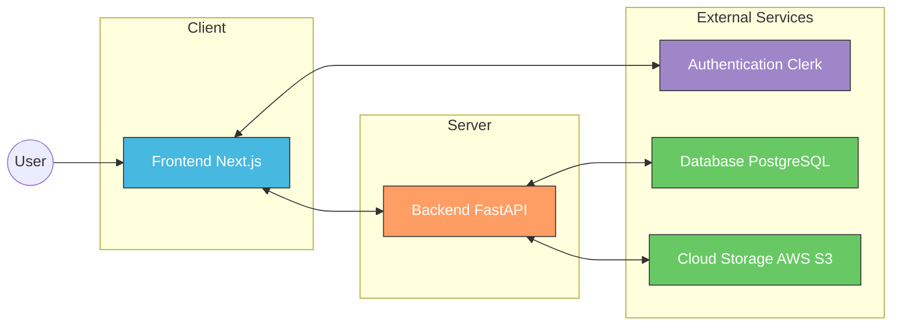
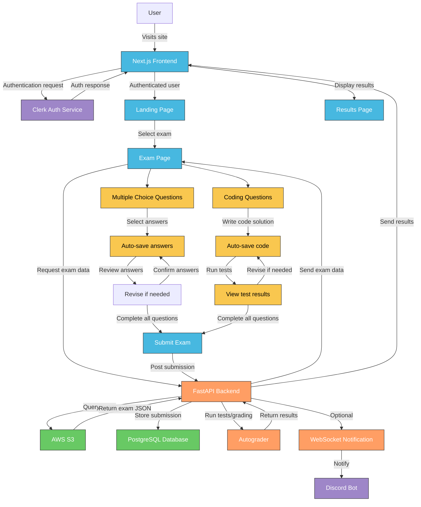

# CS eAssessment Platform

This document provides a detailed overview of the eAssessment Platform, an online platform designed to deliver online exams for Coderschool's courses.

## Table of Contents

- [CS eAssessment Platform](#cs-eassessment-platform)
  - [Table of Contents](#table-of-contents)
  - [Project Overview](#project-overview)
  - [System Architecture](#system-architecture)
  - [Key Features](#key-features)
    - [1. Authentication and Authorization](#1-authentication-and-authorization)
    - [2. Exam Types](#2-exam-types)
    - [3. User Experience](#3-user-experience)
    - [4. Administration](#4-administration)
  - [Tech Stack](#tech-stack)
    - [Frontend](#frontend)
    - [Backend](#backend)
  - [Application Flow](#application-flow)
  - [Folder Structure](#folder-structure)
    - [Frontend (Next.js)](#frontend-nextjs)
    - [Backend (FastAPI)](#backend-fastapi)
  - [Authentication (in development)](#authentication-in-development)
  - [Detailed Component Documentation](#detailed-component-documentation)

## Project Overview

The eAssessment Platform is a comprehensive online examination platform designed for Coderschool courses. It facilitates:

- Multiple-choice assessment for theoretical knowledge
- Coding problems with live code execution capabilities
- Real-time progress tracking and result compilation

The system follows a modular approach with distinct sections for different types of exams (SQL, Python, Pandas) and assessment types (multiple choice and coding problems).

## System Architecture



Key architectural components include:

1. **Frontend Layer**: 
   - Next.js for server-side rendering and route handling
   - State management with React Hooks
   - Shadcn UI components with Tailwind CSS

2. **Backend Layer**:
   - FastAPI for backend processing and API endpoints
   - Exam code execution and evaluation using pure Python
   - Submission processing and storage
   - Websocket connections for Discord realtime notifications

3. **Authentication Layer**: 
   - Clerk for secure user authentication and session management
   - Role-based access control

4. **Data Storage**: 
   - PostgreSQL database for storing user submissions and exam results
   - AWS S3 for storing exam content, exam solutions, and test cases

## Key Features

### 1. Authentication and Authorization
- User registration and login via Clerk
- Role-based access for students and administrators
- Public and authenticated exam modes

### 2. Exam Types
- Multiple-choice assessments with automatic grading
- Coding problems with real-time execution and validation
- Support for SQL, Python and Pandas problem types

### 3. User Experience
- Responsive design for desktop and mobile access
- Rich code editing experience with syntax highlighting
- Progress tracking and auto-saving of responses

### 4. Administration
- Comprehensive submission tracking
- Detailed performance analytics
- Custom scoring and feedback mechanisms

<div style="display: flex;">
  
  
</div>

<div style="display: flex; margin-top: 10px;">
  
  
</div>

## Tech Stack

### Frontend
- **Framework**: Next.js 15.1
- **Language**: TypeScript
- **State Management**: React Hooks
- **Styling**: Tailwind CSS
- **UI Components**: Shadcn UI
- **Code Editor (for code submission)**: CodeMirror

### Backend
- **Framework**: FastAPI
- **Language**: Python
- **Database**: PostgreSQL (Neon) via SQLAlchemy ORM
- **Storage**: AWS S3
- **Code Execution & Evaluation**: Python
- **Real-time Notification (for Discord)**: WebSockets

## Application Flow



The diagram above illustrates the flow of the CSE Exam System:

1. **User Authentication**:
   - User visits the application
   - Authentication is handled via Clerk
   - Upon successful login, user is redirected to the landing page

2. **Exam Retrieval**:
   - User selects an exam from the landing page
   - Frontend requests exam data from the FastAPI backend
   - Backend retrieves the exam JSON from AWS S3
   - Exam content is delivered to the frontend

3. **Exam Completion**:
   - User navigates through multiple choice questions and code problems
   - For multiple choice questions:
     - User selects answers which are auto-saved
     - User reviews answers and revises if needed
     - User confirms answers
   - For code problems:
     - User writes code solutions in the embedded editor
     - User can run tests to validate their solutions
     - User can view test results and revise their code if needed
   - After completing all questions, user submits the exam

4. **Submission Processing**:
   - Backend stores the submission in PostgreSQL
   - Autograder evaluates code submissions and calculates scores
   - Optional WebSocket notification is sent to Discord for monitoring

5. **Results Display**:
   - Results are sent back to the frontend
   - User sees their score and feedback

## Folder Structure

The application is organized into two main components:

### Frontend (Next.js)

```
/ (Home)                    # Landing page
├── /auth                   # Authentication routes managed by Clerk
│   ├── /sign-in           
│   └── /sign-up          
│
├── /exams                  # Main exam portal listing available exams
│   └── /[examId]           # Specific exam page (M11, M12, M21, M31)
│       ├── /multichoice    # Multiple choice section with 20 questions
│       │   └── /[id]       
│       ├── /problem        # Coding problems section
│       │   └── /[id]      
│       └── /final          # Final submission and review page
│           └── /success   
├── /help                   # Report issue page
│
├── /profile                # User profile and settings management
│   ├── /?view=history    
│   └── /?view=settings   
│
├── /courses                # Course catalog and learning materials
│   └── /[courseId]         # Individual course page
│       └── /assignments    # Course assignments and practice problems
│
├── /v0                     # Public version of exam system (No need to sign in)
│   └── /[examId]        
│       ├── /multichoice 
│       ├── /problem      
│       └── /final       
│
└── /submissions          # Submission review and results
    └── /[examId]/[submissionId] 
```

### Backend (FastAPI)

```
/cspyclient                   # FastAPI backend root directory
├── /app                      # FastAPI application
│   ├── /csautograde          # Code evaluation and autograding
│   │   ├── __init__.py
│   │   ├── autograder.py     # Autograding logic for code submissions
│   │   ├── resource_manager.py # Resource utilization and limitations
│   │   └── utils.py          # Utility functions for code execution
│   │
│   ├── /routers              # API route definitions
│   │   ├── exams.py          # Endpoints for retrieving exam data
│   │   └── submissions.py    # Endpoints for handling student submissions
│   │
│   ├── database.py           # Database connection and session management
│   ├── main.py               # FastAPI app configuration and startup
│   ├── models.py             # SQLAlchemy ORM models
│   ├── schemas.py            # Pydantic models for request/response validation
│   └── websocket.py          # WebSocket manager for Discord notifications
│
├── /db                       # Database files and utilities
│   ├── chinook.db            # SQLite sample databases for SQL problems
│   ├── northwind.db
│   ├── sakila.db
│   ├── salaries.csv          # CSV data for data analysis problems
│   ├── create_db.py          # Database creation script
│   └── load.northwind.sample.sql # SQL script for initializing sample data
│
├── /solutions                # Reference solutions for autograding (A copy is stored on AWS S3)
│   ├── M11.yml               # Solution files for each exam module
│   ├── M12.yml
│   ├── M21.yml
│   ├── M21_test_cases.json   # Test cases for programming problems
│   ├── M31.yml
│   └── M32.sample.yml
│
├── .env                      # Environment variables file
├── Procfile                  # Deployment configuration for Heroku
├── README.md                 # Backend documentation
└── requirements.txt          # Python dependencies
```

## Authentication (in development)

The application uses Clerk for authentication with custom middleware to:

- Protect private routes from unauthorized access
- Redirect unauthenticated users to the login page
- Allow public access to specific routes without authentication

Authentication is handled through the middleware.ts file which creates route matchers for public routes and enforces authentication for all other routes.

For now, the platform does not maintain user accounts and does not enforce authentication. Learners are required to input their emails to attempt the exam.

## Detailed Component Documentation

For more detailed documentation on specific components and functionality, please refer to the dedicated documentation files:

- [User Guide](./docs/USER_GUIDE.md) - Guide for students and administrators
- [Backend API](./docs/BACKEND_API.md) - Documentation of FastAPI endpoints
- [Technical Configuration](./docs/TECHNICAL.md) - Server and environment setup
- [Exam Types](./docs/EXAM_TYPES.md) - Different problem types and grading