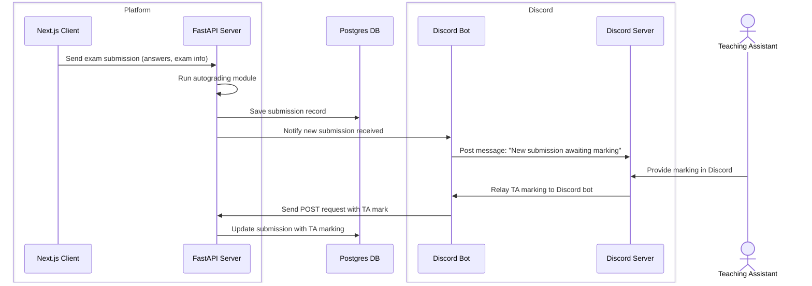
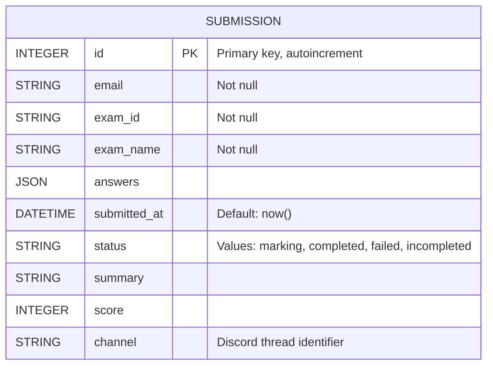

# Sequence diagram

```mermaid
sequenceDiagram
    box Platform
    participant C as Next.js Client 
    participant F as FastAPI Server 
    end
    
    participant DB as Postgres DB

    box Discord
    participant D as Discord Bot 
    participant DC as Discord Server 
    end

    actor TA as Teaching Assistant 

    C->>F: Send exam submission (answers, exam info)
    F->>F: Run autograding module
    F->>DB: Save submission record
    F->>D: Notify new submission received
    D->>DC: Post message: "New submission awaiting marking"
    TA->>DC: Provide marking in Discord
    DC->>D: Relay TA marking to Discord bot
    D->>F: Send POST request with TA mark
    F->>DB: Update submission with TA marking
```

```mermaid
erDiagram
    SUBMISSION {
      INTEGER id PK "Primary key, autoincrement"
      STRING email "Not null"
      STRING exam_id "Not null"
      STRING exam_name "Not null"
      JSON answers
      DATETIME submitted_at "Default: now()"
      STRING status "Values: marking, completed, failed, incompleted"
      STRING summary
      INTEGER score
      STRING channel "Discord thread identifier"
    }

```